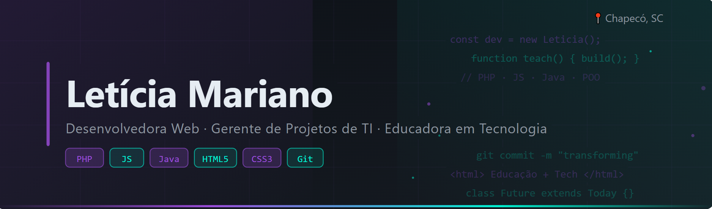

# 👩‍💻 Letícia Mariano

## 🚀 Técnica de Ensino | Desenvolvimento de Sistemas | Web & Educação em Tecnologia

---

## 👋 Sobre mim

Sou **Técnica de Ensino no SENAI Chapecó (SC)**, atuando nos cursos de:

- 💻 Desenvolvimento de Sistemas  
- 🌐 Informática para Internet  
- 🎮 Desenvolvimento de Jogos Digitais  

Tenho experiência sólida em **educação tecnológica e desenvolvimento web**, unindo prática docente, programação e formação profissional.

---

## 🛠️ Tecnologias e Ferramentas

### 💻 Linguagens de Programação

---

### 🌐 Desenvolvimento Web

---

### ⚙️ Ferramentas

---

## 🎓 Experiência Profissional

### 🏫 SENAI Chapecó – Atual
- Técnica de Ensino
- Atuação com:
  - Programação Web (PHP, POO)
  - Front-end (HTML, CSS, JavaScript, Bootstrap)
  - Desenvolvimento de Sistemas
  - Jogos Digitais

---

### 🏫 SENAI Palmas/PR
- Professora de Informática Básica
- Turmas da Aprendizagem Industrial
- Formação profissional para o mercado de trabalho

---

### 🏫 IFPR – Campus Palmas (PSS)
- Professora por 2 anos
- Disciplinas:
  - Desenvolvimento Web (Java, PHP, JavaScript)
  - Programação Orientada a Objetos (POO)
  - Gerenciamento de Projetos
  - Estágio Supervisionado

---

## 🔬 Pesquisa & Extensão

### 🎓 Bolsista CNPq & Fundação Araucária
Projeto: **Mulheres e Meninas na Ciência e Tecnologia**

- Incentivo à presença feminina na tecnologia
- Projetos de extensão e inovação educacional

🏆 Conquistas:
- 🥇 1º lugar – Relato de Experiência (Contextos e Conceitos)
- 🥈 2º lugar – Projeto “Baralho das Variáveis”

---

## 🎯 Atualmente focada em

- Desenvolvimento Web com PHP e POO  
- Front-end moderno (HTML, CSS, JavaScript)  
- Ensino técnico aplicado à prática profissional  
- Projetos educacionais e inovação em tecnologia  

---

## 🌟 Diferenciais

- 👩‍🏫 Experiência sólida em ensino técnico e profissional  
- 💡 Integração entre educação e tecnologia  
- 🚀 Vivência com pesquisa e extensão científica  
- 🎓 Formação de alunos para o mercado de TI  
- 🤝 Incentivo à inclusão feminina na tecnologia  

---

## 📫 Contato

- 💼 LinkedIn:www.linkedin.com/in/leticiamariano
- 📧 Email:letiiciamariano97@gmail.com
- 🌐 Meu GitHub: https://github.com/leticiamariano97 

---

## 💬 Frase que me define

> “Educação e tecnologia juntas têm o poder de transformar futuros.” 🚀
